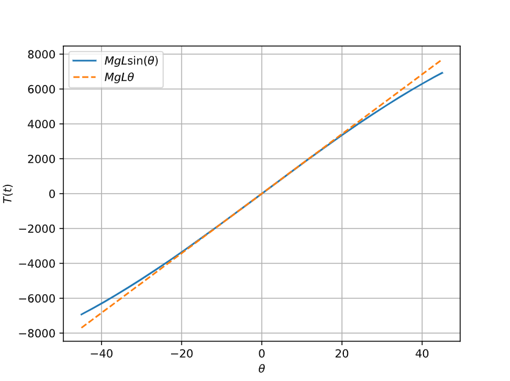

Mathematical models of physical systems are crucial for designing and analyzing control systems, typically described by ordinary differential equations. We will examine various systems, focusing on the nonlinear nature of most physical systems. Linearization approximations will be discussed to facilitate the use of Laplace transform methods. We will derive input-output relationships in the form of transfer functions, which can be organized into block diagrams or signal-flow graphs. These visual tools help in conveniently analyzing and designing complex control systems.

# Desired outcomes
Upon completion of this section, you should be able to:

+ [ ] Recognize that differential equations can describe the dynamic behavior of physical
systems. 

- [ ] Utilize linearization approximations through Taylor series.

- [ ] Understand the application of Laplace transforms and their role in obtaining transfer functions.

- [ ] Interpret block diagrams and signal-flow graphs and explain their role in analyzing control systems.

- [ ] Describe the important role of modeling in the control system design process.

# 1. Introduction
To understand and control complex systems, one must obtain quantitative ­mathematical models of these systems. It is necessary therefore to analyze the relationships between the system variables and to obtain a mathematical model. 

Because the systems under consideration are dynamic in nature, the descriptive equations are usually differential equations. Furthermore, if these equations can be linearized, then the Laplace transform can be used to simplify the method of solution. 

In practice, the complexity of systems and our ignorance of all the relevant factors necessitate the introduction of assumptions concerning the system operation. Therefore we will often find it useful to consider the physical system, express any necessary assumptions, and linearize the system. Then, by using the physical laws describing the linear equivalent system, we can obtain a set of time-invariant, ordinary linear differential equations. Finally, using mathematical tools, such as the Laplace transform, we obtain a solution describing the operation of the system. 

In summary, the approach to dynamic system modeling can be listed as follow:
1. Define the system and its components.
2. Formulate the mathematical model and the fundamental necessary assumptions based on first (basic) principles.
3. Obtain the differential equation representing the mathematical model.
4. Examine the solutions and the assumptions
5. If necessary, reanalyze or redesign the system.

# 2. Differential equations 
The differential equations describing the dynamic performance of a physical system
are obtained by utilizing the physical laws of the process. Let consider the following damping system:
![[cap24.png]]

+ **System description:**

  The damping system under consideration consists of the following elements:
  - A spring with a spring constant $k$.
  - A mass $M$ suspended vertically from this spring and assumed to oscillate inside a hollow cylinder.
  - The inner lateral walls of the cylinder have a viscous friction coefficient $b$.
  - We can apply to the mass $M$ an external force $r(t)$ to cause there motion.

+ **System modeling:**

  By applying the Newton second law, we can establish the following second-order linear time-invariant ODE  for this mechanical system:
  $$
   M \ddot{y} + b \dot{y} + k y = r(t)
  $$
  Many physical systems are linear within some range of the variables. In general, systems ultimately become nonlinear as the input are increased without limit. For a system to be linear, it must satisfies the properties of **superposition** and **homogeneity** otherwise it will become non linear.

  In general a non linear system can be represented by the following relation between input $x(t)$ and the output $y(t)$:
  $$
  y(t) = f(x(t))
  $$
  With $f$ a non linear function. To recover the linear property of the system we can use the Taylor series expansion around some operating point $x_0$:
  $$
y(t) = f(x_{0}) + \left.\dfrac{df}{dx}\right\vert_{x=x_{0}}(x-x_{0})+ \left.\dfrac{d^2f}{dx^2}\right|_{x=x_{0}}\frac{(x-x_{0})^2}{2}+\dots
  $$
  When considering only small variations around the operating point $x_0$, we can linearize the system by taking the Taylor series expansion up to the first-order term.

  $$
y(t) \approx f(x_{0}) + \left.\dfrac{df}{dx}\right\vert_{x=x_{0}}(x-x_{0})
  $$
  Let consider $m=\left.\dfrac{df}{dx}\right\vert_{x=x_{0}}$ the slop at the operation point $x_0$, then we obtain:
  $$
\begin{aligned}
y &= f(x_{0}) + m (x-x_{0})\\
&= y_{0} + m(x-x_{0})\\
y - y_{0} &= m (x - x_{0})\\
\Delta y &= m \Delta x
\end{aligned}
  $$With $y_{0}= f(x_{0})$. This is the linear model of the system when considering a small deviation around $x_0$. 

***Example: Pendulum oscillator model*** 

Consider the pendulum oscillator shown in the following figure
![[cap25.png]]
The torque on the mass is given by:
$$
T(t) = MgL\sin(\theta(t))
$$
The equilibrium condition is obtained for $\theta=0$. Therefore we can linearize this system around this equilibrium point:
$$
\begin{aligned}
T(t)&\approx T(0) + MgL \left.\dfrac{d}{d\theta}\sin(\theta)\right\vert_{\theta=0}\theta\\
T - T_{0}&\approx MgL\theta\\[0.25cm]
\Delta T&\approx MgL\;\theta\\
\end{aligned}
$$
This approximation is reasonably accurate for −π/ 4 ≤ θ ≤ π/ 4. For example, the response of the linear model for the swing through $\pm30°$ is within $5\%$ of the actual response of the nonlinear pendulum response.

```run-python
pi = np.pi
theta = np.linspace(-pi/4,pi/4,256)
M,g,L = 1000,9.8,1
T = M*g*L*np.sin(theta)
fig = plt.figure()
ax = fig.add_subplot(111)
ax.plot(theta*180/pi,T,label=r'$MgL\sin(\theta)$')
ax.plot(theta*180/pi,M*g*L*theta,label=r'$MgL\theta$', ls='dashed')
ax.set_xlabel(r'$\theta$')
ax.set_ylabel(r'$T(t)$')
ax.grid()
ax.legend()
plt.show()
```




# 3. Solving the Ordinary Differential Equation.
We have already established the ODE for the spring-mass-damping system:
$$
M\ddot{y} + b \dot{y} + k y = r(t)
$$
We can convert this ODE into an algebraic equation by using the direct Laplace transform:
$$
M\ddot{y} + b \dot{y} + k y = r(t) \overset{\mathcal{L}}{\Leftrightarrow} (s^{2}+ {b \over M}s+{k\over M})Y(s) = (s + {b\over M})y_{0} + \dot{y}_{0}+{1\over M}R(s)
$$
Solving the differential equation by using temporal integration:

```run-python
from diffeqpy import de 
from matplotlib import pyplot as plt 
import numpy as np 

def r(t): 
    return de.ifelse(t>=0,1.0,0.0)

def ode2(u,p,t):
    m, b, k = p
    y, z = u 
    return [z,-b/m * z - k/m * y + r(t)/m]

zeta = .1 #1/(2*2**(0.5))
wn = 1.0
m = 1.0
p = (m,2*zeta*wn*m,wn**2*m)
u0 = [.15,0.0]
tspan = (0.0,30.0)

prob = de.ODEProblem(ode2,u0,tspan,p)

integrator = de.init(prob,de.Tsit5(),saveat=0.1)
integrator.opts.abstol = 1e-9
integrator.opts.reltol = 1e-9
de.step_b(integrator,30.0) 

sol = integrator.sol


y = de.transpose(de.stack(sol.u))[:,0]
tt = sol.t 

fig = plt.figure()
ax = fig.add_subplot(111)

ax.plot(tt, y, label=r'$y(t)$')
ax.set_xlabel('Time [s]')
ax.set_ylabel(r'$y(t)$')

ax.legend()
ax.grid()
fig.tight_layout()

plt.show()
```

If We consider that $\dot{y}_{0}=0$, then:
$$
Y(s) = \underbrace{\frac{s+{b\over M}}{s^{2}+ {b \over M}s+{k\over M}}y_{0}}_{\mathrm{ZIR}} + \underbrace{\frac{1\over M}{s^{2}+{b \over M}s+{k\over M}}R(s)}_{\mathrm{ZSR}} 
$$
In both the ZIR and the ZSR, the solution is determined by the zeros of the following polynomial in $s$:
$$D(s)=s^{2}+{b\over M}s+ {k\over M}$$
Let take $\omega_{N}^2={k\over M}$ the natural frequency of the system and $\zeta={b\over 2\sqrt{Mk}}$ the damping ration, then **the characteristic equation** for this system becomes:
$$
D(s) = s^{2}+ 2\zeta\omega_{N}s+\omega_{N}^{2}=0
$$
This characteristic equation admits two solutions in $\mathbb{C}$ (**the LTI-system poles**):
$$
p_{1,2}=-\omega_{N}\left(\zeta\pm\sqrt{\zeta²-1}\right)
$$
By taking the inverse Laplace transform of $Y(s)$, we can reach the time response of the system for some input $r(t)$:
$$
y(t) = \mathcal{L}^{-1}\left\{\frac{s+2\zeta\omega_{N}}{s^{2}+2\zeta\omega_{N} s+\omega_{N}^2}y_{0} + \frac{1\over M}{s^{2}+2\zeta\omega_{N} s+\omega_{N}^2}R(s)\right\}
$$

```run-python
import sympy as sp
from sympy import pprint, symbols, simplify, inverse_laplace_transform, assuming, latex
from sympy.abc import s, t

M, R0, y0 = 1.0, 1.0, 1.5
ze, wn = symbols('ze wn')
R = R0/s
Y = ((s+2*ze*wn)/(s**2+2*ze*wn*s+wn**2))*y0 + R/M/(s**2+2*ze*wn*s+wn**2)
fig = plt.figure()
ax = fig.add_subplot(111)

pprint(Y)
y = simplify(inverse_laplace_transform(Y,s,t))

p = sp.plot(y.subs({ze:0.1, wn:1.0}),(t,0.0,30.0),show=False,legend=True)
tt, yt = p[0].get_data()
plt.plot(tt,yt,label=r'$y_{out}(t)$')
ax.grid()
ax.legend()
ax.set_xlim(0.0,tt[-1])
ax.set_xlabel('Time [s]')
ax.set_ylabel(r'$y(t)$')
plt.show()
```
## 3.1 Zero input response
To analyze the response of the system to the input $r(t)$, let focus first on the ZIR term. According to the values of the damping ratio $\zeta$, we can encounter three distinct cases:

+ **Over-damped system $\mathbf{\zeta>1}$**
  In This case the poles of the system are reals and are localized in the left half of the complex frequency s-plane.

```run-python
from sympy import symbols, pprint, inverse_laplace_transform, plot, assuming, latex

s, t, ze , wn, y0 = symbols('s t ζ ωₙ y0')
ZIR = (s + 2 * ze * wn)/(s**2 + 2 * ze * wn * s+wn**2)*y0
pprint(ZIR)
with assuming(ze >1, wn>0,y0!=0):
	yzir = inverse_laplace_transform(ZIR,s,t)
	print('################################')
	print(latex(yzir))
	print('################################')
	
	
p = plot(yzir.subs({y0:1.0,ze:3.0,wn:1.0}),(t,0.0,30.0),show=False)
fig = plt.figure()
ax = fig.add_subplot()
t,yt = p[0].get_data()
ax.plot(t,yt,label=r'$y_{zir}(t)$')
ax.grid()
ax.legend()
ax.set_xlabel('Time s')
ax.set_ylabel(r'$y_{zir}(t)$')
plt.show()
```

$$
y_{zir}(t) = y_{0} \left(\frac{ζ ωₙ e^{- t ζ ωₙ} \sin{\left(t \sqrt{ωₙ^{2} \left(1 - ζ^{2}\right)} \right)}}{\sqrt{ωₙ^{2} \left(1 - ζ^{2}\right)}} + e^{- t ζ ωₙ} \cos{\left(t ωₙ \sqrt{- \left(ζ - 1\right) \left(ζ + 1\right)} \right)}\right) u\left(t\right)
$$

+ **Critical damped system: $\mathbf{\zeta=1}$**
  In this case, the friction is just concealed and the system have real poles  localized also in the left half of the complex frequency s-plane.


```run-python
from sympy import symbols, pprint, inverse_laplace_transform, plot, assuming, latex

s, t, ze ,  wn, y0 = symbols('s t ze wn y0')
ZIR = (s + 2 * ze * wn)/(s + wn)**2 * y0
pprint(ZIR)
with assuming(ze == 1, wn>0,y0!=0):
	yzir = inverse_laplace_transform(ZIR,s,t)
	print('################################')
	print(latex(yzir))
	print('################################')
	
	
p = plot(yzir.subs({y0:1.0,ze:1.0,wn:1.0}),(t,0.0,30.0),show=False)
fig = plt.figure()
ax = fig.add_subplot()
t,yt = p[0].get_points()
ax.plot(t,yt,label=r'$y_{zir}(t)$')
ax.grid()
ax.legend()
ax.set_xlabel('Time s')
ax.set_ylabel(r'$y_{zir}(t)$')
plt.show()
```
$$
y_{zir}(t)=y_{0} \left(t ωₙ + 1\right)e^{- t ωₙ} u\left(t\right)
$$

  In this case, the poles of the system are a conjugate complex pair and they are also localized in the left half of the complex frequency s-plane. 
  
+ **Under-damped system: $\mathbf{0<\zeta<1}$**

```run-python
from sympy import symbols, pprint, inverse_laplace_transform, plot, assuming, latex

s, t, ze ,  wn, y0 = symbols('s t ze wn y0')
ZIR = (s + 2 * ze * wn)/(s**2 + 2 * ze * wn * s+wn**2)*y0
pprint(ZIR)
with assuming(ze < 1, ze > 0 , wn>0,y0!=0):
	yzir = inverse_laplace_transform(ZIR,s,t)
	print('################################')
	print(latex(yzir))
	print('################################')
	
	
p = plot(yzir.subs({y0:1.5,ze:0.01,wn:1.0}),(t,0.0,30.0),show=False)
fig = plt.figure()
ax = fig.add_subplot()
t,yt = p[0].get_points()
ax.plot(t,yt,label=r'$y_{zir}(t)$')
ax.grid()
ax.legend()
ax.set_xlabel('Time s')
ax.set_ylabel(r'$y_{zir}(t)$')
plt.show()
```

$$
y_{zir}(t) = y_{0} \left(\frac{ζ ωₙ e^{- t ζ ωₙ} \sin{\left(t \sqrt{ωₙ^{2} \left(1 - ζ^{2}\right)} \right)}}{\sqrt{ωₙ^{2} \left(1 - ζ^{2}\right)}} + e^{- t ζ ωₙ} \cos{\left(t ωₙ \sqrt{- \left(ζ - 1\right) \left(ζ + 1\right)} \right)}\right) u\left(t\right)
$$
The locus of the poles of the system when the value of the damping coefficient changes from $0\rightarrow\infty$ is given by the following figure:
![[cap26.png]]
 In all three cases, the transient response eventually fades away, leading to the steady-state response.
 
## 3.2 Zero-state response
The second term in the system response obtained previously corresponds to the zero-state response of the system:
$$
y_{\mathrm{ZSR}}(t)=\mathcal{L}^{-1}\left\{\frac{{1\over M}}{s² + 2\zeta\omega_{N}s+\omega_{N}²}R(s)\right\}=(A e^{-\omega_{N}t-(\zeta+\sqrt{\zeta^{2-1})}t}u(t)+B e^{-\omega_{N}t-(\zeta-\sqrt{\zeta^{2-1})}t}u(t))*r(t)
$$
### 3.2.1 Impulse response 
The impulse response is obtained directly by taking the inverse transform of the transfer function:
$$
kh(t) = \mathcal{L}^{-1}\left\{\frac{\omega_N²}{s² + 2\zeta\omega_{N}s+\omega_{N}²}\right\}
$$

```run-python
import control as ct
import numpy as np
import matplotlib.pyplot as plt


ze = 0.1
wn = 1
H = ct.tf([0,wn**2],[1,2*ze*wn,wn**2])
tt, yzsr = H.impulse_response()
plt.plot(tt,np.array(yzsr),label=rf"$\zeta={ze}, \omega_N={round(wn)}$", color='blue')
plt.xlabel("Times [s]")
plt.ylabel(r"$y_{\mathrm{ZSR}}(t)$")
plt.title(r"Impulse response of the system")
plt.grid('on')
plt.legend()
plt.show()
```
### 3.2.2 Step response 
In this case we have $r(t)=u(t)$ then the zero-state response in Laplace domain is given by:
$$
Y_{\mathrm{ZSR}}(s) = \frac{{1\over M}}{s² + 2\zeta\omega_{N}s+\omega_{N}²}{1\over s} = {A\over s} + {B\over s-p_{1}} + {C\over s-p_{2}}
$$

By taking the inverse Laplace transform of the $Y_{\mathrm{ZSR}}(s)$ we obtain:
$$
y_{\mathrm{ZSR}}(t) =\underbrace{(Be^{p_{1}t} + Ce^{p_{2}t})u(t)}_\text{transient response}+ \underbrace{Au(t)}_\text{steady-state response} 
$$
In this response, we observe two components: 
+ One that consists of the natural modes of the system and represent the transient response $(Be^{p_{1}t} + Ce^{p_{2}t})u(t)$. Normally, it will fades away after certain amount of time if the $\Re\{p_{i}\}<0$ otherwise the system my blow up.
+ The second that depends on the type of input used to excite the system and forms the steady-state response of the system.

The step response is usually used to evaluate the system performance (Percent overshoot, settling time, rise time, integral of absolute error, $\dots$) 

```run-python
import control as ct
import numpy as np
import matplotlib.pyplot as plt

def u(tt):
	out = []
	for t in tt:
		out.append(1.0) if t>0 else out.append(0.0)
	return out

xi = 0.1
wN = 2*np.pi*100
H = ct.tf([0,wN**2],[1,2*xi*wN,wN**2])
tt, yzsr = H.step_response()
plt.plot(tt,np.array(yzsr),label=rf"$\zeta={xi}, \omega_N={round(wN)}$", color='blue')
plt.xlabel("Times [s]")
plt.ylabel(r"$y_{\mathrm{ZSR}}(t)$")
plt.plot(tt,u(tt),label=rf"$u(t)$", color='red', alpha=0.5)
plt.title(r"Step response of the system")
plt.grid('on')
plt.legend()
plt.show()
```

### 3.2.3 Harmonic response 
In the ZSR response we can identify the transfer function of the system:
$$
H(s) = \frac{{1\over M}}{s^{2}+ 2\zeta\omega_{N}s + \omega_{N}²}
$$
By evaluating the transfer function only for s belonging to imaginary axis of the s-plane then we obtain the harmonic response of the system:

$$
H(\jmath\omega)= {1\over k}\frac{\omega_N²}{\omega_{N}² - \omega² + 2\jmath\zeta\omega_N\omega} 
$$
Let calculate the harmonic response of the system for an input like follow:
$$
r(t) = 1\cos(\omega_0 t)
$$
$$
ky(t) =  \mathcal{F}^{-1}\left\{\frac{\omega_N²}{\omega_{N}² - \omega² + 2\jmath\zeta\omega_N\omega}\times{1\over 2}(\delta(\omega-\omega_0)+\delta(\omega+\omega_0))\right\}
$$

```run-python
import control as ct
import numpy as np
import matplotlib.pyplot as plt

w0 = 2*np.pi*100
tt = np.linspace(0.0,.125,1024)
xt = np.sin(w0*tt)
xi = 0.1
wn = 2*np.pi*100
H = ct.tf([0,wn**2],[1,2*xi*wn,wn**2])
X = ct.tf([1,0],[1,0,w0**2])
tt, y1 = H.forced_response(timepts=tt,inputs=xt)
plt.plot(tt,np.array(y1),label=rf"$\zeta={xi}, \omega_N={round(wn)}$", color='blue')
plt.xlabel("Times [s]")
plt.ylabel(r"$y_{\mathrm{ZSR}}(t)$")
plt.plot(tt,xt,label=rf"$r(t)$", color='red', alpha=0.5)
plt.title(r"Harmonic response of the system")
plt.grid('on')
plt.legend()
plt.show()
```

# 4. The transfer function of a LTI-system
The transfer function of a linear system is defined as the ratio of the Laplace transform
of the output variable to the Laplace transform of the input variable, with all initial
conditions assumed to be zero. 
$$
H(s) = \frac{Y(s)}{X(s)} \quad \text{For all initial condition assumed to be zero}
$$
The transfer function of a system (or element) represents the relationship describing the dynamics of the system under consideration.

A transfer function may be defined only for a linear, stationary (constant
­parameter) system. A non-stationary system, often called a time-varying system,
has one or more time-varying parameters, and the Laplace transformation may not
be utilized. Furthermore, a transfer function is an input–output description of the
­behavior of a system. Thus, the transfer function description does not include any
information concerning the internal structure of the system and its behavior.

***Example 01 (second-order transfer function)***
The transfer function of the spring-mass-damper system is obtained from it's
ODE, assuming zero initial conditions as follows:

$$
H(S) = \frac{Y(s)}{R(s)}=\frac{1}{Ms²+bs+k}
$$

***Example 02 (first-order transfer function)***
The transfer function of the RC network shown in the following figure:
![[cap27.png]]
is obtained by writing the Kirchhoff voltage equation, yielding:

$$
H(s) = \frac{V_{2}(s)}{V_{1}(s)}=\frac{1}{RCs+1}=\frac{1}{\tau s + 1}\quad\text{with }\tau=RC
$$

# 5. Block diagram models 
The dynamic systems that comprise feedback control systems are typically represented mathematically by a set of simultaneous differential equations. As we have noted in the previous sections, the Laplace transformation reduces the problem to the solution of a set of linear algebraic equations. Since control systems are concerned with the control of specific variables, the controlled variables must relate to the controlling variables. This relationship is typically represented by the transfer function of the subsystem relating the input and output variables. Therefore, one can correctly assume that the transfer function is an important relation for control engineering.


![[diag12.svg]]

The importance of this cause-and-effect relationship is evidenced by the facility to represent the relationship of system variables graphically using block diagrams. Block diagrams consist of unidirectional, operational blocks that represent the transfer function of the systems of interest.
***Example: negative feedback loop system***

![[diag16.svg]]

$$
H_{cl}(s) = \frac{C(s)A(s)P(s)}{1+C(s)A(s)P(s)H(s)}
$$

The block diagram representation of feedback control systems is a valuable and widely used approach. The block diagram provides the analyst with a graphical representation of the system interrelationships. Furthermore, the ­designer can readily visualize the possibilities for adding blocks to the existing system block diagram to alter and improve the system performance.

***Exercise: Block diagram reduction***
Perform the successive reduction of this blocks diagram:
![[diag17.svg]]


# 6. Signal flow graph diagrams
Block diagrams are adequate for the representation of the interrelationships of controlled and input variables. An alternative method for determining the relationship between system variables has been developed by Mason and is based on a representation of the system by line segments. The advantage of the line path method, called the signal-flow graph method, is the availability of a flow graph gain formula, which provides the relation between system variables without requiring any reduction procedure or manipulation of the flow graph.

The transition from a block diagram representation to a directed line segment representation is easy to accomplish by reconsidering the systems of the previous section. A signal-flow graph is a diagram consisting of nodes that are connected by several directed branches and is a graphical representation of a set of linear relations. Signal-flow graphs are particularly useful for feedback control systems because feedback theory is primarily concerned with the flow and processing of signals in systems. The basic element of a signal-flow graph is a unidirectional path segment called a branch, which relates the dependency of an input and an output variable in a manner equivalent to a block of a block diagram.

![[cap29.png]]
The equivalent blocks diagram of this flow graph is given by the following illustration:

![[diag18.svg]]
[[Mason formula]]
# 8. Simulation
Application of the many classical and modern control system design and analysis tools is based on mathematical models. Most popular control design software packages can be used with systems given in the form of transfer function ­descriptions. In this course, we will focus on m-file / Python scripts containing commands and functions to analyze and design control systems. 
We begin this section by analyzing a typical spring-mass-damper mathematical model of a mechanical system. Using an m-file script, we will develop an interactive analysis capability to analyze the effects of natural frequency and damping on the unforced response of the mass displacement. This analysis will use the fact that we have an analytic solution that describes the unforced time response of the mass displacement.
A spring-mass-damper mechanical system is described by the differential equation:
$$
M\ddot{y}+b\dot{y}+ky = x
$$
## 8.1 Unforced Response
The unforced dynamic response $y(t)$ of the spring_mass-damper system is:
$$
y(t) = \frac{y_{0}}{\sqrt{1-\zeta^{2}}}e^{-\zeta\omega_{N}t}\sin(\omega_{N}\sqrt{1-\zeta²}t+\theta),\quad\theta=\cos^{-1}(\zeta)
$$
Let's simulate this unforced response for the following parameters:
$$
y_{0}=0.15,\;\omega_{N}=\sqrt{2},\; \zeta = {1\over 2\sqrt{2}}
$$
```run-python
y0 = 0.15
wN = np.sqrt(2)
zeta = 1/2/np.sqrt(2)
theta = np.acos(zeta)
tt = np.arange(0.0,10.0,0.1)
yet =y0/np.sqrt(1-zeta**2)*np.exp(-zeta*wN*tt) 
yt = y0/np.sqrt(1-zeta**2)*np.exp(-zeta*wN*tt)*np.sin(wN*np.sqrt(1-zeta**2)*tt+theta)
plt.plot(tt,yt,label=r'$y(t)$',color='red')
plt.plot(tt,-yet,label='Envelope',color='blue',alpha=0.25,linestyle='dashed')
plt.plot(tt,yet,label='',color='blue',alpha=0.25,linestyle='dashed')
plt.xlabel('Times [s]')
plt.ylabel(r'$y(t)$')
plt.title('Unforced spring-mass-damper system response')
plt.legend()
plt.grid(True)
plt.show()
```
# 8.2 Transfer function
The transfer function of the spring-mass-damped system is obtained by assuming all initial condition equal to zero:
$$
H(s)=\frac{\omega_{N}^{2}}{s² + 2\zeta\omega_{N}s+\omega_{N}²}
$$
Let simulate this transfer function for the same parameters:
+ **Poles ans zeros**

```run-python
wN = np.sqrt(2)
zeta = 1/2/np.sqrt(2)
num = [0,1]
den = [1,2*zeta*wN,wN**2]
H = ct.tf(num,den)
print(f'The zeros of the trransfer function are: {H.zeros()}')
print(f'The poles of the transfer function are: {H.poles()}')
zpmap = ct.pole_zero_map(H)
zpmap.plot(grid=True)
plt.show()
```

+ **Impulse response**

```run-python
wN = np.sqrt(2)
zeta = 1/2/np.sqrt(2)
num = [0,1]
den = [1,2*zeta*wN,wN**2]
H = ct.tf(num,den)
tt, h = H.impulse_response()
plt.plot(tt,h,label=r'$h(t)$',color='blue')
plt.xlabel('Times [s]')
plt.ylabel(r'$h(t)$')
plt.title('Impulse response of the system')
plt.legend()
plt.grid(True)
plt.show()
```

+ **Frequency response of the system**

```run-python
wN = np.sqrt(2)
zeta = 1/2/np.sqrt(2)
num = [0,1]
den = [1,2*zeta*wN,wN**2]
H = ct.tf(num,den)
modH,argH, w = H.frequency_response()
fig = plt.figure()
ax = fig.add_subplot(211)
ax.plot(w,20*np.log10(modH),label=r'$\vert H (\jmath\omega)\vert$',color='blue')
ax.set_xscale('log')
ax.set_xlabel('Frequency [rd/s]')
ax.set_ylabel(r'$\vert H(\jmath\omega)\vert_{dB}$')
ax.set_title('Frequency response of the system')
ax.legend()
ax.grid(which='both')
ax = fig.add_subplot(2,1,2,sharex=ax)
ax.plot(w,argH,label=r'$\vert \angle{H} (\jmath\omega)\vert$',color='blue')
ax.set_xscale('log')
ax.set_xlabel('Frequency [rd/s]')
ax.set_ylabel(r'$\vert \angle{H}(\jmath\omega)\vert$')
ax.legend()
ax.grid(which='both')
fig.tight_layout()
plt.show()
```

[[Quiz 02]]

[[State space models]]
